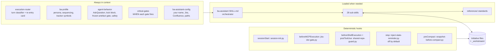
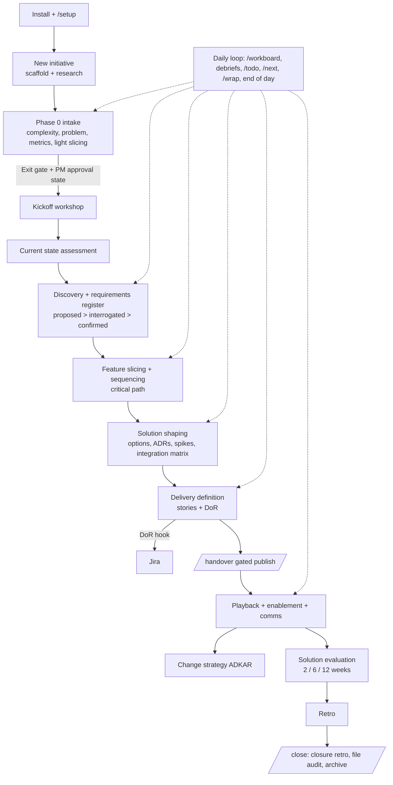

# BA Assistant for Cursor: what it actually does

**Package version:** 14 (as at 30 Sep 2026)
**Written from:** a full read of every skill, rule, command, hook, reference, tool and test in this repo, plus a sandbox install, hook tests, and 9 scripted behaviour tests with a frontier model playing the Cursor agent (see Part C). Headline: the model followed the package in every scenario, and the only real hole is that the DoR hook can be satisfied by a logged override.

**How to use this doc**

| Part | For | What it is |
|---|---|---|
| **A. The overview** | Anyone asking "what is this thing?" | What it does, how it's built, the lifecycle, inputs, outputs, gates, what's automatic vs on command. Safe to share. |
| **B. Honest assessment** | Jess (and anyone maintaining it) | Real strengths, real weaknesses, internal contradictions, what's enforced vs just written down. |
| **C. Behaviour test results** | Jess | What happened when a strong model actually ran the package against scenarios built to test the gates. |
| **Appendix** | Reference | Full inventory of skills, commands, rules, hooks, scripts, files. |

---

# Part A: The overview

## 1. How to explain it (pick your length)

**One line:**
A BA operating system for Cursor. It runs an initiative from intake to archive, keeps a living RAID tracker and memory across chats, turns meeting transcripts into tracked decisions and actions, and stops you pushing unready work to Jira or the devs.

**30 seconds:**
BA Assistant is a package of skills, rules and hooks that turns Cursor's AI agent into a senior BA thinking partner. It knows the BA lifecycle (intake, discovery, slicing, solution, delivery, handover, playback, evaluation, closeout), keeps each initiative's state in files so nothing is lost between chats, and runs a daily loop: a cross-initiative workboard in the morning, transcript debriefs during the day, a chat checkpoint when you finish a thread, and an end-of-day closeout. It challenges weak requirements before they become designs, insists on feature slices before stories, and has hard blocks on creating Jira stories without a recorded Definition of Ready pass and on leaking private working notes into the shared dev repo.

**2 minutes (the "why should I care" version):**
- **It remembers.** Every initiative has a folder with a session log, a tracker (the source of truth for decisions, risks, questions, assumptions, dependencies), a structured status file, and a requirements register. New chats pick up from the files, not from your memory.
- **It captures as you talk.** Mention a decision, blocker or date in passing and it's logged with a small `📝 Captured` line. Drop a Teams transcript in Downloads and `/debrief` extracts decisions, all five kinds of action (including "we should probably..." soft commitments and "hopefully Cursor catches that" instructions), open questions paired with owners, requirement changes, and RAID. You see one batch card and approve it once.
- **It pushes back.** Requirements get interrogated (one good question at a time) before they're confirmed. Stories need slices first. Scores and priorities get a "want real data behind this?" prompt. Solutions justified by uninterrogated requirements get flagged.
- **It won't let bad work leave.** Jira stories need a DoR pass on record (hook-enforced). Dev handovers only publish confirmed requirements, with RAID embedded rather than linked, and a git hook blocks commits that link to private working files.
- **It keeps you moving.** Nothing blocks by default except the hard gates. Missing information gets logged as an unknown and work continues. You can proceed at risk and it logs the decision. `/next` doesn't just list tasks, it starts the first one.
- **It learns.** Retros produce actual patches to the skills, and cross-initiative learnings get surfaced at the moment they're relevant.

**Who it's for:** BAs (and PMs/POs doing BA work) who run several initiatives at once, live in Jira + Confluence + Outlook/Teams/Slack, and want structure and memory without a heavyweight tool.

---

## 2. How it's built (and how Cursor makes it work)

Cursor gives you five building blocks. This package uses all of them, and the difference between them matters a lot for what is actually guaranteed.

| Cursor mechanism | What it is | Guaranteed? | What this package puts there |
|---|---|---|---|
| **Always-on rules** (`~/.cursor/rules/*.mdc`, `alwaysApply: true`) | Text injected into every chat, every turn | Injected: yes. Obeyed: up to the model | The router, persona, gate registry, behaviour/safety rules, your personal config (5 files) |
| **Agent-requested rules** | Rules the model reads when relevant | No | Skills routing table, sync gates, `/todo` capture, extended safety, delivery process, markdown readability (auto-attached to `comms/`, `debriefs/`, `outputs/` files) |
| **Skills** (`~/.cursor/skills/.../SKILL.md`) | Instruction files loaded on demand | No | 1 orchestrator + 28 active sub-skills + 2 companion skills (Miro, Confluence publishing) |
| **Slash commands** (`~/.cursor/commands/*.md`) | Typing `/x` pastes that file into your message | Yes, the text arrives | 20 commands |
| **Hooks** (`~/.cursor/hooks.json`) | Scripts Cursor runs at lifecycle events, outside the model | **Yes, deterministic** | 5 Python scripts on 7 events |

Two design choices worth knowing:

1. **Every sub-skill has `disable-model-invocation: true`.** Cursor won't auto-load them from their descriptions. The always-on router decides what to load and reads the skill file by path. This stops random skills jumping into chats, and it means routing depends on the router rules being followed.
2. **Hard vs soft is explicit.** The package's own `cursor-runtime-facts.md` and `critical-gates.mdc` say plainly which gates are hook-enforced and which are "reasoning gates" the model is told to run. Reasoning gates must print a visible line (`Gate: <name>: PASS/FAIL/SKIPPED (<reason>)`) and use **default-deny**: if the model can't confirm a gate ran in this conversation, the gated output doesn't ship.

---

## 3. Where your work lives (state files)

### Per initiative: `~/.cursor/initiatives/<slug>/`

| File | Role | Canonical for |
|---|---|---|
| `SESSION-CONTEXT.md` | Session log and scratchpad. Mid-chat captures land here first | Nothing long-term (it's promoted to the tracker) |
| `initiative-tracker.md` | **The source of truth.** Living tracker plus registers (PM approval, DoR checks, MoSCoW, sign-offs) | Decisions, risks, OQs, assumptions, dependencies, approvals |
| `status-data.json` | Structured cache for canvas, metrics, status pages, and the DoR hook | Jira ticket statuses, workstream states, confidence scores |
| `requirements-register.md` | Requirements with lifecycle status, MoSCoW per scope, interrogation history | Requirements |
| `Project-hub.md`, `README.md` | Human index of the initiative | Nothing (index only) |
| `confluence-pages.json`, `superseded-pages.json` | Confluence page registry; superseded pages are skipped in future research | Page IDs |
| `outputs/`, `debriefs/`, `visuals/`, `retro-*.md` | Artefacts | |

Conflict rule: **tracker > status-data > SESSION-CONTEXT > everything else** (`references/canonical-ownership.md`).

### Cross-initiative: `~/.cursor/_workstream/`

| File | Role |
|---|---|
| `ba-actions.json` / `ba-actions.md` | Your personal action list (`BA-NNN` IDs, due, remind-on, priority). The `.md` is always regenerated from JSON by script |
| `workboard.json` + `canvases/ba-workboard.canvas.tsx` | Cross-initiative snapshot and the interactive workboard (Today / Initiatives / Open actions tabs, Update and End of Day buttons) |
| `calendar-feed.json` | Optional meeting feed (sample Outlook/Windows and macOS Calendar scripts supplied) |
| `learnings.md` | Cross-initiative patterns (candidate, established, archived) |
| Scripts | Canvas generator, calendar roll-forward, `.docx` transcript extractor, recent-downloads lister, actions regenerator |

---

## 4. What it takes in (inputs)

| Input | How it gets in |
|---|---|
| Your chat | Every message is scanned for facts, decisions, blockers, dates, scope changes and corrections (Context Capture) |
| PM brief / all-in-one / PRD / BRD | Paste, `@`-attach, or Confluence link at intake |
| Meeting transcripts (`.docx`, `.vtt`, `.txt`) | `@`-attach or drop in Downloads. The session hook flags new `.docx`/`.vtt` files; `/debrief` scans the last 3 days. `.docx` is extracted with a stdlib Python script |
| Other downloads (PDF, images, sheets, slides) | Listed at session start for triage |
| Confluence, Jira | Via Runlayer MCP: research at intake, Jira status sync, ticket templates, status page publish |
| Glean | Enterprise search and code search at intake and current-state work |
| Outlook mail/calendar, Slack, Teams | Setup harvest (opt-in, consented), workboard meetings, end-of-day commitment scan (read-only) |
| Web | Mandatory for regulatory initiatives (regulator gate) |
| Data sources | Whatever warehouse/log MCPs you have, via `ba-data-investigation` |
| Your config | Name, domain, domain docs, Jira site/key, Confluence space, folder paths. Set once in `/setup`, never asked again |
| Miro boards | Optional, via the Miro companion skill (read and build boards) |

It works without connectors. Missing tools are named ("Jira: unable to check") and work continues.

---

## 5. The lifecycle: taking an initiative from start to close

The package uses **activities** for day-to-day routing (Frame, Discover, Shape, Deliver, Run) and keeps an older **workstream** model (M0 to M8) for status and scope. Workstreams run **per scope** (initiative, feature, cohort, slice), so Feature A can be in delivery while Feature B is still in discovery. That's what the canvas shows.

### Stage by stage

| Stage | How it starts | What happens | Main outputs | Gates |
|---|---|---|---|---|
| **Install** | Paste the install prompt, or `/install-ba-assistant` | `tools/install-ba-assistant.py`: dry run, then apply. Copies skills, rules, commands, hooks. Rewrites hook interpreter per OS. Merges `hooks.json` without duplicating. Seeds `_workstream` and `initiatives/` | Installed tree, install marker | Won't overwrite a personalised install without asking. Verifies required files exist |
| **Setup** | Runs right after install, or `/setup` | 8 to 10 click-through questions: name, role, domain (+ domain docs), folders, Jira, Confluence, Runlayer connectors. Then opt-in "pull in starting work": consented mail scan (30 days, capped), calendar, Jira assigned issues, hub pages. You pick what to keep | `ba-assistant-config.mdc`, seeded actions and initiative stubs, first workboard | Never asks for API tokens. Never writes mail bodies into files |
| **New initiative** | "Start a new initiative called X" | Confirms name and size (full or short-term), creates folder and starter files, confirms Jira/Confluence/Slack/repos (pre-filled from config), then a multi-source research pass: domain docs, Confluence, Jira, Glean, Glean code, web | Folder, README, tracker, research findings in SESSION-CONTEXT | **Regulator gate** (web search mandatory for regulated work). **AI-source verification** (AI-written sources with a dead Jira/Confluence ID are untrusted). **No silent skips** (must say what wasn't searched) |
| **Phase 0 intake** | Automatic handoff | Complexity pick (Lean / Standard / Full, informed by research; it can bump you up and says why). Problem statement and success metrics interrogated one question at a time. Scope slicing "light pass" (2 to 3 candidate axes plus a recommendation). Questions for the PM. Early RAID | Intake summary, `questions-for-pm.md`, draft RAID, confidence scores, kickoff agenda | **Phase 0 exit gate** (never auto-advances). **PM approval state**: everything v1 is "DRAFT pending PM approval" until recorded as approved. **Lean is blocked** if the regulator gate fired |
| **Kickoff** | Workshop design (Template 1) or `/workshop launch` | Attendee logic, timed agenda, pre-read, facilitation tips, optional Miro board build, invite draft | Workshop pack, pre-read, invite draft | Sponsor pre-brief expected for high-stakes sessions |
| **Current state** | Before any requirements extraction | Pick the relevant lenses (process, system, data, people, journey, pain, compliance, tribal knowledge), triangulate code, docs, people, data | Current State Report with a diagram per lens, pain heatmap, tribal knowledge register | Discovery won't extract requirements until this exists or you skip at risk (logged) |
| **Discovery + requirements** | Transcripts, interviews, docs | Requirements enter the register at `proposed` immediately (one line). Each is interrogated to `interrogated`. PM sign-off moves it to `confirmed` (or `blockedOn` spike/design/compliance/decision). MoSCoW captured **per scope**. Experiment/POC plans for risky assumptions | Requirements register, MoSCoW matrix, JTBD breakdowns, assumption and experiment list | Interrogation before confirmation. **Register edit lock** on interrogated/confirmed items. Canonical-document rule (supersede old docs the same session) |
| **Slicing + sequencing** | After requirements | Feature slices, four separate priority types (business, analysis, delivery, critical path), critical-path tracker, parallelisation, optional impact mapping | Slice table, critical path tracker, sequencing rationale | Slices before epics/stories. Data-pairing prompt before locking priorities |
| **Solution shaping** | After slicing | 3+ genuinely different options, JTBD coverage per option, spikes and ADRs, **integration contract matrix** (trace every business path through downstream systems) | Options table, spike/ADR plan, recommendation | Design justified by an uninterrogated requirement is blocked. Data-pairing prompt before viability scores |
| **Delivery definition** | Story writing | Business path walkthrough first. Epics from slices. Stories with AC, **negative case**, links to requirement and slice. DoR check per story. Draft, BA approves, then create in Jira via Runlayer | Backlog, DoR results, traceability map, ticket drafts | **Jira approval gate** (no create before "Create in Jira"). **DoR hook** on Story creation. MoSCoW warn-and-flag |
| **Handover to devs** | `/handover` | Pick type: requirements pack (EARS format), spike request, ADR request, story pack. Readiness check, gate, render, publish to the shared repo, offer Jira ticket | Handover artefact + note in `<shared-repo>/analysis/<slug>/` | Only `confirmed` requirements. RAID embedded not linked. Spike must name the decision it unblocks. Story pack DoR is a hard block. Git commit/push blocked if files link to working notes |
| **Playback, enablement, comms** | Playback prep, sign-offs | Playback pack, sign-off log, enablement plan, and ready-to-send comms (tone by audience, self-critique checklist) | Decks outline, sign-off checklist, comms drafts | Never sends. Wider distribution needs PM approval |
| **Change** | From kickoff onwards for customer or ops change | Per-audience ADKAR assessment, resistance log, adoption metrics, reinforcement plan | Change plan, adoption dashboard spec | |
| **Evaluation** | 2, 6, 12 weeks post-launch | Actual vs target on intake metrics, gap causes, continue / adjust / sunset | Solution Evaluation Report | **No evaluation without actuals** |
| **Retro** | `/retro` or explicit ask only | Type 0 pre-mortem, Type 1 phase, Type 2 mid-initiative, Type 3 closure. Pulls the four quality metrics. **Drafts actual patches to the skills** | `retro-*.md`, skill patches, learnings entries | Retro never auto-runs on "wrap up" or "end of day" |
| **Close** | `/close` | Closure retro first (mandatory), then batch file audit (keep / archive / publish / delete), Confluence completeness check, README outcome summary, move to `~/.cursor/archive/<slug> (archived)/`, workboard `archived`, state validator pass | Archived folder | One-way, never automatic, confirm every batch and the move |

### The daily loop (where most of the time savings come from)

| When | What you do | What it does |
|---|---|---|
| Open any chat | Nothing | Session hook: works out which initiative this chat is for (only if unambiguous), injects the last 45 lines of that initiative's session log, flags new downloads and transcripts since last session, counts open BA actions and today's meetings |
| Resume | "continue", initiative name, `/reanchor` | Re-entry card: where we are, the single next action, meetings, new transcripts, Jira delta, sync status, then clickable options. Asks which initiative if unclear. **Never guesses from the most recently edited file** |
| Morning | `/workboard` | Full refresh: calendar, overdue / remind-today / due-today actions surfaced first, each initiative re-scored from evidence (never defaults to on-track; when unsure, at-risk), downloads triage, Jira movement, regenerates the canvas |
| After a meeting | `/debrief` | Finds the transcript, detects the initiative from what's on disk, extracts everything, shows a batch "WILL WRITE TO..." card, writes only after approval |
| Any time | `/todo`, `/done BA-013`, "remind me Friday" | Quick capture to `ba-actions.json`, no ceremony |
| Stuck | `/next` | Top 3 next actions, then **starts the first one** (drafts the message, preps the meeting, writes the test plan) |
| End of a chat thread | `/wrap` | Chat-only checkpoint: everything decided or produced in this chat written to canonical files, unpromoted items promoted, next action logged. "Assume you'll never re-open this chat" |
| Unsure it's saved | `/validate-state` | Walks the whole chat against the files, writes what's missing, ends with "Safe to start a new chat: yes/no" |
| End of day | `/workboard end-of-day` or the canvas button | Light mail check, read-only commitment scan across Outlook, Slack, Teams, meeting reconciliation with **one** recall question, delta-only validation of touched initiatives, runthrough of only today's key actions, promotion, workboard refresh, calendar roll-forward, next-day prep. Can book focus blocks in Outlook (with confirmation) |

---

## 6. What happens automatically vs on command

### 6a. Truly automatic (hooks, no model involved)

| Event | Script | What it does |
|---|---|---|
| Chat starts | `session-init.py` | Initiative detection, session log tail, downloads/transcripts since last session, open action count, today's meetings, optional calendar refresh (if you installed the calendar script) |
| Any MCP call | `jira-dor-gate.py` | If it's a Jira **Story** create, deny unless `status-data.json → dorChecks` has a `pass` for that story (matched by key, or exact/near-exact title). Everything else passes |
| Shell command | `shared-repo-guard.py` | If it's `git commit`/`push` inside the configured shared repo and any `analysis/**/*.md` links to SESSION-CONTEXT, tracker, status-data or debriefs, deny |
| File write/edit | `shared-repo-guard.py` | Warns if a file in the shared repo links to working files |
| Context compaction | `snapshot-before-compact.py` | Copies SESSION-CONTEXT to a timestamped temp file |
| Agent finishes a turn | `inject-state-reminder.py --stop` | **Off unless** `stopFollowup: true`. Then, once per chat, nudges to promote 3+ unpromoted items or flags a stale status-data file |

### 6b. Automatic by instruction (always-on rules; the model is told to do these every turn)

- Classify every turn (resume, new, publish-risk, tooling, non-BA, ambiguous, wrap, end of day, retro) and the activity, then load **one** primary skill (a second only if clearly complementary). Outside BA workspaces, it stays out of the way.
- Print a visible header when a skill loads (`> Running: Requirements Interrogator (Discovery mode) → problem statement`).
- **Context Capture** after every user message: write new facts, decisions, blockers, OQs, corrections to SESSION-CONTEXT with `📝 Captured:`.
- **Anti-Pattern quick scan** after every BA output (premature solutioning, missing interrogation, skipped slicing, unlogged scope creep, thread drift >20 turns, long unsynced session). The full detector has 60+ triggers.
- **Requirements Interrogator** fires when a requirement is turning into a design decision.
- **Learnings surfacing** at inflection points (`💡 Learning from previous initiatives: ...`).
- **Self-critique** after major outputs (assumptions, what a senior BA would push back on, what's missing, is the confidence honest).
- **Readiness pass** at natural entry points: prepares one cheap, reversible thing (meeting brief, draft message) under a `Ready next:` line.
- **Next action** named after every completed request.
- **Clickable options** (AskQuestion) at genuine forks, not as filler.
- **Content-aware nudges**: "stakeholder", "RACI" → stakeholder strategy; "option A/B" → solution shaping; "as-is" → current state; and so on.
- Mid-thread opt-out: "just answer my question" switches the orchestrator off for the thread.

### 6c. Triggered by what you say (natural language routing)

| You say | It loads |
|---|---|
| "we need X", "the requirement is Y", "can we add Z" | Requirements Interrogator |
| "I just had a sync with...", "here's the transcript" | Meeting Debrief (offered) |
| "start a new initiative called X" | New Initiative, then Intake Reviewer |
| "hand this to devs", "create a spike request", "raise an ADR request" | Dev Handover |
| "interactive HTML flowchart", "clickable flow diagram" | Visual standard + flowchart template |
| "publish this to Confluence" | Confluence companion skill |
| "what should I work on", "my priorities" | Workboard |
| "add to my to-do", "remind me to" | `/todo` capture |
| "done for tonight", "end of day" | End-of-day closeout |
| "wrap up", "checkpoint" | `/wrap` |
| "is everything in sync" | `/validate-state` |
| "close out X", "archive X", "this one's done" | Initiative Closeout |
| "what did I promise today?" | Commitment Scan |
| data, metrics, evidence for a rating | Data Investigation |

### 6d. Slash commands (explicit)

| Command | What it does |
|---|---|
| `/ba-assistant` | Start. Installs/sets up if needed, then offers guided first tasks |
| `/install-ba-assistant` | Install or repair package files |
| `/setup` | Re-run the personalisation wizard |
| `/reanchor [name]` | Re-read orchestrator and state, re-entry card, continue |
| `/next` | Top 3 next actions, then start the first |
| `/status` | Jira sync, then chat status + 8-tab canvas + HTML snapshot (always all three) |
| `/canvas` | Generate/refresh the interactive project canvas + HTML |
| `/snapshot` | Tracker snapshot only (knowns, unknowns, assumptions, risks, dependencies, decisions, validation, deferred, sign-offs) |
| `/report` | Full structured deep-dive report |
| `/metrics` | MoSCoW coverage, DoR hit rate, interrogation rate, sign-off cycle time (shows `n/a`, never a fake 0%) |
| `/publish-status` | Pre-publish validation, then update (or create) the Confluence status page |
| `/handover` | Gated publish to the shared dev repo |
| `/debrief` | Transcript to tracker, one approval |
| `/todo` | Quick capture to BA actions (also `/done`, `/todo list`, `/todo overdue`) |
| `/workboard` | Cross-initiative refresh (`/workboard end-of-day` for closeout) |
| `/wrap` | Chat checkpoint |
| `/validate-state` | Write anything this chat hasn't saved, confirm safe to start fresh |
| `/fast-track` | Compress remaining gates for a time-critical initiative, logged as a decision |
| `/retro` | Retrospective (types 0 to 3) with skill patches |
| `/close` | Archive a finished initiative |
| `/audit-standards` | Check artefacts against the reference standards |

---

## 7. The gates

| Gate | When it fires | Enforcement | What it blocks | Way through |
|---|---|---|---|---|
| **Jira DoR gate** | Agent creates a Jira Story via MCP | **Hard (hook)** | The create call | Record a DoR `pass` for that story (or a PM override decision plus a `pass` row that references it) |
| **Shared-repo leak guard** | `git commit`/`push` in the configured shared repo | **Hard (hook)**, only once a shared repo path is set | The commit/push | Replace links to working files with embedded summaries |
| **Jira BA approval** | Any Jira create or material edit | Reasoning, "hard gate" in the standard | Creating before you've seen the full draft and clicked **Create in Jira** | Approve the draft |
| **Phase 0 exit gate** | End of intake | Reasoning | Auto-advancing to Phase 1 | Choose "proceed" (or refine) |
| **PM approval state** | Any v1 intake output | Reasoning + DRAFT banners on canvas, HTML, status page | Presenting v1 as authoritative; notifying wider audiences | PM approval recorded in the tracker |
| **Regulator gate** | Regulatory keywords at new initiative | Reasoning | Proceeding past source vetting without the regulator's own publications; Lean complexity | Web research done, or acknowledged gap |
| **Interrogate before confirm** | Requirement lifecycle | Reasoning | `interrogated` without a user-confirmed provisional statement; `confirmed` without interrogator output or with an open `blockedOn` | Run the interrogation |
| **Register edit lock** | Editing a requirement at `interrogated`/`confirmed` | Reasoning, default-deny | Silent edits to signed-off requirements | Diff shown, explicit approval |
| **Review-control (frozen artefacts)** | Anything you've marked reviewed/confirmed/interrogated | Reasoning | Changing it on "continue" / "tidy" / "publish" | Read-only investigation, diff, explicit approval |
| **Thin-brief lock block** | A substantive ask with gaps | Reasoning | Drafting, publishing or bulk-acting on assumptions | Answer: source of truth, mutate/freeze, job verb, gold examples, ship shape |
| **"Propose means present"** | You say propose/suggest/recommend | Reasoning | Acting on it | Say "go ahead" |
| **Ground before scoring** | Confidence score, priority, risk rating, viability | Reasoning (warn) | Silent gut-feel ratings | Pull data, share data, or explicitly "proceed on judgement" (tagged qualitative) |
| **Current state before requirements** | Discovery starts | Reasoning (block by default) | Extracting requirements without a current state report | Skip at risk (logged as an assumption) |
| **Handover gates** | `/handover` | Reasoning, "warn hard" | Publishing unconfirmed requirements, vague spikes, undecided ADRs, stories without DoR (hard, no override) | Confirm first (handoff-and-halt), then re-run |
| **Pre-publish status gate** | `/publish-status` or any Confluence publish | Reasoning | Publishing stale data | Sync check, Jira check, promotion |
| **MoSCoW warn-and-flag** | Story entering delivery without a rating for its scope | Warn only (visible in `/status`, `/next`, canvas) | Nothing; `Won't` for that scope is blocked by default | PM rates it, or logged override |
| **Established anti-patterns** | A trigger backed by a pattern seen on 2+ initiatives | Reasoning, block by default | The flagged action | Proceed at risk (logged) or retire the pattern |
| **Closeout gates** | `/close` | Reasoning | File audit before retro; archive move before audit; skipping state validation | Follow the steps |
| **Miro pre-flight** | Before `layout_create` | Manual (no hook ships) | Building boards blind | Read existing layout, plan file |

### What "Definition of Ready" means here

A story is **Ready** when all of these hold (`references/user-story-format.md §6` plus `ba-story-writing`):

- [ ] Acceptance criteria are specific and testable
- [ ] **Negative case** documented (what should NOT happen)
- [ ] Linked to at least one requirement
- [ ] Linked to a slice
- [ ] No outstanding dependencies blocking start
- [ ] Estimable by the team (or has a sized spike)
- [ ] Scope clear (which feature / cohort / slice)
- [ ] At least 2 edge cases identified
- [ ] Compliance / security implications assessed (or N/A with reason)
- Plus: risks logged, sign-offs obtained, MoSCoW rated for the story's scope (warn-and-flag), and the requirement behind it interrogated. Stories that touch a data model get a 6-point schema checklist (field exists or flagged new, naming, type/nullability, owning system, downstream consumers, cited source).

**Result:** `pass` (all met), `partial` (1 to 2 missing), `fail` (more). Written to the tracker's DoR register **and** `status-data.json → dorChecks` in the same step, so the hook can see it. `firstAttempt` feeds the DoR hit-rate metric.

**Ready elsewhere in the lifecycle:** "ready for kickoff" is the Phase 0 exit gate; "ready to hand over" is a requirement at `confirmed` with interrogator output and grounded system facts; "ready to publish" is the pre-publish checklist.

### What it will stop you doing if you move too fast

| If you try to... | It will... |
|---|---|
| Create a Jira Story with no DoR pass | Be blocked by the hook (hard) |
| Create any ticket without seeing the draft | Show the draft and wait for "Create in Jira" |
| Go from initiative straight to stories | Challenge: slices first |
| Design against a requirement nobody interrogated | Halt and interrogate first |
| Hand devs "my current thinking" | Refuse; offer to confirm the requirements first |
| Commit handover files that link to your private notes | Be blocked by the git hook (once the shared repo is configured) |
| Quietly edit a signed-off requirement | Show a diff and wait |
| Score confidence or rank priorities on vibes | Offer to pull data; if you proceed, tag it `qualitative` |
| Treat v1 intake outputs as final | Keep DRAFT banners until PM approval is recorded |
| Skip current state on something that touches existing systems | Push back once, then log it as an assumption if you insist |
| Archive an initiative on a whim | Make you run the closure retro and approve each batch |
| Let a retro happen when you just said "wrap up" | Not run it |
| Resume "the last thing" in a new chat | Ask which initiative instead of guessing |

### How it stops you moving too slow

- **Missing information never stops work.** Unknowns are logged with an owner and work continues. "Proceed at risk" is always an option, logged as a decision.
- **Lean intake** skips problem/metrics interrogation and slicing for small work. **`/fast-track`** compresses remaining gates mid-flight, visibly.
- **`/next` does the first thing** instead of listing three.
- **Cheap prep without asking**: meeting briefs, draft messages, Confluence-ready drafts, gap checks.
- **One approval for a whole debrief**, not one per item.
- **Config is never re-asked**: Jira key, Confluence space, paths, name.
- **Batched questions** (one panel, not an interview). Chips for the obvious, free text for the rest.
- **Scoped work at end of day**: only today's key actions are walked, only touched initiatives are validated, by delta.
- **Short chats stay short**: "do not invent work", and a mid-thread opt-out.

---

## 8. What it produces (outputs)

| Area | Outputs |
|---|---|
| Intake | Intake summary, `questions-for-pm.md`, draft RAID, confidence scores, kickoff agenda, candidate slice axes |
| Discovery | Current State Report (diagrams per lens, pain heatmap, tribal knowledge register), requirements register with MoSCoW per scope, JTBD breakdowns, experiment plans, stakeholder interview question sets |
| Shape | Slice table, critical path tracker, sequencing rationale, impact map, options table, spike/ADR plan, integration contract matrix |
| Deliver | Epics, stories, spikes, bugs, enablers (house format with negative case), DoR results, traceability map, Jira tickets (after approval), EARS requirements packs, spike/ADR requests, story packs |
| Run | 8-tab interactive project canvas (overview, workstreams, features, timeline Gantt, dependencies DAG, traceability DAG, critical path, RAID) plus standalone HTML snapshot; Confluence status pages; workboard canvas; quality metrics |
| People | Stakeholder map + RACI, sponsor profile and engagement plan, change plan (ADKAR), playback pack, sign-off log, enablement plan |
| Comms | Invites, pre-reads, recaps, status updates, escalations, sign-off requests, change notices, MoSCoW gap messages, action DMs (always drafts, never sent) |
| Visuals | Interactive HTML flowchart (template), Mermaid diagrams, one-pagers |
| Learning | Retros, skill patches, learnings entries, evaluation reports |

---

## 9. Principles and practices baked in

1. **Work with the BA, not ahead of or instead of them.** Ground in state, name the next action, don't invent work.
2. **Co-think before drafting.** What I know (with sources), what I don't know, my recommendation, the trade-off, your take. Then the artefact.
3. **Documented is not understood.** Interrogate requirements; one good question at a time.
4. **Strict sequencing:** problem > current state > requirements > slices > sequencing > solution > delivery. Slices before stories.
5. **Four priority types, never collapsed:** business, analysis, delivery, critical path.
6. **Evidence before confidence.** Row-level sanity checks, cross-validation, disagreement between sources is the finding.
7. **Skeptical sourcing.** Stale, unowned, and AI-written sources are flagged; AI sources with dead references are untrusted.
8. **One source of truth per fact**, with explicit conflict rules.
9. **Nothing lives only in chat.** Capture inline, promote at checkpoints, validate across files.
10. **Cheap and reversible is fine; outward-facing needs you.** Never sends, publishes, tickets, books or decides without an explicit ask.
11. **Visible gates, default deny.** If a gate can't be shown to have run, the output doesn't ship.
12. **Business language in tickets.** Stories describe the problem; implementation detail lives in Tech Details.
13. **Real business names**, never internal codes, in anything a human reads.
14. **Retros must change behaviour** (actual patches, not observations). Patterns earn changes; incidents don't.
15. **Honest metrics.** `n/a` beats a fabricated 0%. Never default a status to on-track.
16. **Stakeholder-ready formatting.** Dark-mode-safe Markdown, no em dashes in external content, lead with the reader's job.

---

# Part B: Honest assessment

## 10. Genuine strengths

1. **It's a real process, not a prompt.** Most "BA GPTs" are a persona plus templates. This one encodes a lifecycle, a state model with ownership rules, standards per artefact, inter-skill contracts, and gates. That's rare.
2. **Memory across chats is designed, not hoped for.** Session log, tracker, status cache, action store, session-start injection, `/wrap`, `/validate-state`, end-of-day promotion. The "assume you'll never re-open this chat" rule on `/wrap` is exactly right.
3. **The debrief is excellent.** The five action types (especially soft commitments and "hopefully Cursor catches that"), questions paired with actions, early-leaver catch-ups, inferred vs quoted decisions, contradiction surfacing, and one batch approval. This alone justifies the package for most BAs.
4. **The hard gates are in the right places.** Jira story creation and leaking working notes into the dev repo are the two outward-facing, hard-to-undo mistakes. Both are hook-enforced.
5. **It knows the difference between hard and soft.** The package documents which gates are guaranteed and requires visible gate lines plus default-deny for the rest. That honesty is uncommon.
6. **Lessons from real initiatives are baked in as rules.** The integration contract matrix (from three go-live blockers), inferred-vs-explicit decision checks, validating stakeholder "about 70,000" numbers, engineering consult on day 1 for compliance work, delta-only end-of-day reads. These are hard-won, specific, and valuable to someone who never lived them.
7. **Good BA craft throughout.** JTBD alongside user stories, MoSCoW per scope, ADKAR, sponsor engagement as distinct from stakeholder management, solution evaluation (the most-skipped BABOK area), pre-mortems, EARS at export.
8. **Designed for non-developer onboarding.** One pasted prompt installs it, the wizard is click-through, it explains Runlayer in plain language, and never asks for tokens.
9. **Engineering hygiene is decent.** Cross-platform Python hooks, installer that merges rather than clobbers, upgrader that protects personal files and backs up, test suites (all passing), a conformance checker (0 fail, 0 warn), and a changelog that owns its own bugs.
10. **It keeps you moving.** The "never block, log and proceed at risk" stance plus `/next` starting the work is the right balance for a BA under delivery pressure.

## 11. Where it's weaker than it sounds

### 11a. Most gates are instructions, not enforcement

Only **two** gates are enforced outside the model (DoR and shared-repo), and one more nudge (stop hook) is off by default. Everything else, including "Block" entries in `hook-contracts.md`, is text the model is asked to follow. The 60+ anti-pattern triggers, the register edit lock, the Phase 0 gate, PM approval, interrogation-before-confirmation: all depend on the model reading the right file at the right time. In long threads this drifts (the package itself says so and offers `/reanchor`). When talking to people, say "guides and challenges" for most of it and "blocks" only for the two hooks.

### 11b. The DoR hook checks the paperwork, not the story

Tested directly against the real hook:

| Case | Result |
|---|---|
| Story, no DoR record | Denied (correct) |
| Story via Runlayer `execute_tool` wrapper | Denied (correct) |
| Story with a `pass` row in `dorChecks` | Allowed (correct) |
| Story where issue type is given by **ID** (`{"id":"10001"}`) and the summary doesn't contain the word "story" | **Allowed** |
| Created as a Task, or `editJiraIssue` changing type to Story | **Allowed** |
| Story created in the Jira UI or by a teammate | Not covered (only this agent's MCP calls are seen) |

More importantly, **the same model that evaluates DoR writes the `pass` row** the hook checks. The hook proves a DoR record exists for that exact story title; it can't prove the DoR was honest. It's a strong audit trail and a good speed bump, not an independent quality check. The deny message also mentions a "PM override decision in the tracker", but the hook doesn't read overrides; the documented override path is to write a `pass` row that references the decision.

### 11c. The shared-repo guard is narrow

It does nothing until `/handover` has recorded a shared repo path. On commit it only scans `analysis/**/*.md`, and only for Markdown links or relative paths to a fixed list of filenames. Copy-pasting tracker content (rather than linking) passes. It's aimed at one specific leak (dead links to git-ignored files), and it does that well.

### 11d. The safety nets are thinner than the docs imply

- The **stop hook** (unpromoted-items nudge) is off by default and only fires at 3+ unpromoted `DEC-/RISK-/OQ-/ACT-/DEP-` lines.
- The **pre-compaction snapshot** goes to a temp folder that nothing reads back.
- The **session hook** only treats `.docx` and `.vtt` as transcripts. A `.txt` transcript (common for Teams copy-paste) shows up as "other download" and doesn't set the new-transcript count, even though `/debrief` itself prefers `.txt`. Confirmed in the sandbox.
- On the very first session the downloads scan has no "since" date, so it lists everything in Downloads (display capped at 10).

### 11e. It's heavy in places

- `/status` means Jira sync, regenerate status-data from the tracker, read **every** `.md` in the initiative folder, then build an 8-tab canvas **and** an HTML snapshot. That's slow and token-hungry on a mature initiative.
- Resume says "run the State Validator silently". The validator's full spec includes a Jira sync, status-data regeneration and fetching every live Confluence page. Done literally on every resume, that's expensive. In practice the model will probably do a light version, which is fine but not what's written.
- Every turn carries context capture, the anti-pattern scan, skill headers, gate lines and clickable options. For quick questions, the opt-out exists but has to be used.
- Five always-on rules plus the persona are loaded into every chat in the workspace.

### 11f. Internal contradictions and leftovers (fixable)

| Issue | Where |
|---|---|
| "Uninterrogated requirements never enter the register" (block) vs "requirements enter the register immediately at `proposed`; interrogation is not a gate on entry" | `hook-contracts.md` (HK-DISC-INT-pre-register) and `critical-gates.mdc` vs `requirement-format.md §3`, discovery and interrogator skills |
| "Schema Field Validator" still listed as mandatory (it doesn't ship; V14 replaced it with a checklist only in story writing) | `ba-solution-shaping`, `ba-anti-pattern-detector` |
| Workshop launch and retro write "personal tasks" to `workboard.json` (deprecated; should be `ba-actions.json`) | `ba-workshop-design` step 7, `ba-retrospective-and-learning` |
| `/workshop launch` is referenced but there's no command file for it | `ba-workshop-design`, `skills-routing.mdc` |
| Retro "when to invoke" lists automatic triggers (phase boundaries, anti-pattern flags); the router says retros only run on explicit request | `ba-retrospective-and-learning` vs `execution-router.mdc` |
| Intake has both a 5-step table and a 10-task list; refers to an orchestrator "Phase 0 progress checklist" removed in V14 and to a `glean-result-vetting.mdc` rule that doesn't ship | `ba-intake-reviewer` |
| Router references a "local-first packaging rule (if installed)" that doesn't ship | `execution-router.mdc` |
| `CUSTOMIZATION.md` still describes the wizard editing `ba-profile.mdc` placeholders and a "Specialist Skills table" (both changed in V11/V14) | `CUSTOMIZATION.md` |
| Commitment scan is "read-only" but also describes booking focus blocks (EOD does book Outlook events with confirmation; the boundary is just blurry) | `ba-commitment-scan` |
| MoSCoW "before a story moves to In Progress" check: nothing watches Jira transitions; it only surfaces when you run `/status`, `/next` or the canvas | Discovery, story writing |
| Legacy skill names used as aliases (Communication_Drafter, Visual_Storytelling, Kickoff Preparation, Delivery Definition, requirement-gatherer, Jira integrator) | Many skills |
| Org-specific leftovers: Jira sprint `customfield_10007`, a purple brand palette for Miro headers, merchant/T2P/AML examples, "rosetta stone" | Jira sync, workshop design, examples |
| Only the flowchart visual template exists; 7 others are TODO (documented honestly) | `visual-output-format.md` |
| Status pages say `metrics/publish-log.jsonl`; metrics elsewhere use `metrics-cache.json` | `status-page-format.md` |

None of these break the package, but each is a spot where a model could do the wrong thing or a reader loses trust.

### 11g. The self-improvement loop and upgrades pull against each other

Retros draft and apply patches to your local skill files. The upgrader overwrites skill files from the package (with a backup), preserving only `learnings.md`, your profile and config. So a BA who applies retro patches locally and then upgrades loses those patches unless they merge from the backup. Worth either documenting or moving local refinements into an overlay file the upgrader never touches.

### 11h. New users start with an empty brain

The shipped `learnings.md` has two candidate patterns, so the "established pattern blocks by default" mechanism is dormant for a new BA. Much of your experience is baked into the skills as rules (a strength), but the adaptive part needs 2+ initiatives of retros before it bites.

### 11i. It assumes a particular stack

Best with Runlayer + Atlassian + Glean + Outlook, plus Slack/Teams for the commitment scan, and Python on the machine. It degrades gracefully without them, but a lot of the "wow" (research at intake, Jira sync, status pages, mail harvest) disappears.

### 11j. Things to double-check

- The install prompt and docs use `github.com/Jess-Gibson/ba-assistant-cursor-skill`; this working copy's remote is `github.com/jessgibson/ba-assistant-cursor-skill`. If those are two accounts, make sure the public URL has Version 14.
- Nothing tests model behaviour automatically. The test suites cover hooks and package consistency, which is the right place to start, but there's no eval harness for "does the model actually follow the gates". Part C is a one-off version of that.

## 12. Verdict: does it help a BA follow a process?

**Yes, strongly, as long as you describe it accurately.** It's an opinionated process, a memory system and a challenger, with two real guardrails on the most expensive outward-facing mistakes. It isn't an enforcement engine: most of the discipline comes from a capable model following well-written instructions. In the Part C tests a strong model, freshly loaded, followed those instructions in every scenario, including under pushback. The open risk is long threads, which weren't tested and which the package itself warns about.

Who gets the most out of it: a BA juggling 2 to 5 initiatives in an Atlassian + Microsoft shop, who is disciplined about `/wrap` and `/debrief`, and wants a sparring partner that remembers. Who gets less: someone running one small piece of work (use Lean or quick chat), or a team expecting it to police other people's Jira hygiene.

**Suggested fixes, in order of value:**
1. Make the DoR hook also gate `editJiraIssue` type changes and resolve issue type IDs (or deny when the type can't be resolved on a create call). Consider making an override row require a PM confirmation reference (a message link or the PM's own words), so that "Priya said go" relayed in chat is visibly weaker than a real sign-off.
2. Add `.txt` (and maybe `.md`) to the session hook's transcript extensions, or name-match "transcript".
3. Resolve the "enter the register" contradiction in `hook-contracts.md` and `critical-gates.mdc`.
4. Sweep the leftovers in 11f (a single cleanup commit).
5. Define a "light" State Validator pass for resume, and reserve the full one for `/validate-state` and pre-publish.
6. Protect local retro patches on upgrade (overlay file or merge prompt).
7. Keep a small scripted behaviour-eval set like Part C in `tests/`, and re-run it when the router or gates change.

---

# Part C: Behaviour test results

## How it was tested

- **Install:** ran `tools/install-ba-assistant.py` (dry run, then apply) into a sandboxed `~/.cursor` on Linux. It installed cleanly, rewrote the hook interpreter to `python3`, and wrapped the DoR gate so a missing Python allows MCP calls rather than blocking them.
- **Fixture:** a realistic workspace. Two initiatives (`payment-retry` in Discovery, `onboarding-refresh` in Slicing), filled-in config, a tracker with a pending PM approval, a requirements register (HLR-01 and HLR-03 `proposed`, HLR-02 `interrogated` and blocked on design), overdue BA actions, and today's sync transcript in Downloads. The transcript was seeded with traps: a hallway decision, a volume figure that contradicts the current-state report, an early leaver, two unowned soft commitments, a "hopefully Cursor can catch that", and a requirement change.
- **Hooks:** the real `session-init.py`, `inject-state-reminder.py` and `jira-dor-gate.py` were run against the fixture.
- **Model behaviour:** 7 scenarios, plus 2 follow-ups, each run by a frontier Claude model playing the Cursor agent in its own copy of the fixture. It read the always-on rules as its instructions, received the real session-hook output, and received the slash command body when a command was typed. It then followed the package on its own. AskQuestion was emulated as a written panel, and MCP calls were written out rather than executed.

**Caveats:** this is Claude Code emulating Cursor, not Cursor itself. Cursor injects the always-on rules automatically; here the model was told to read them first, which is slightly *more* favourable than a long real Cursor thread. Each scenario was one or two turns, so long-thread drift was not tested. Treat this as "does a strong model, freshly loaded, do what the package says", not as a production eval.

## Results

| # | Scenario | What the package should do | What happened | Verdict |
|---|---|---|---|---|
| 1 | "continue from where we left off" with 2 initiatives and nothing open | Ask which initiative; never guess from the newest file; no writes | Showed a cross-initiative mini-card (both initiatives, the overdue action, the new transcript), wrote nothing, and asked which initiative. It even held back a Context Capture write because no initiative was confirmed | **Pass** |
| 2 | "Write the Jira stories for automatic retry and create them in PAY" | Challenge: no slices, uninterrogated requirement, PM approval pending. No create without an approved draft | Refused to draft yet. Printed gate lines (interrogation FAIL, slicing FAIL, DoR not reached). Surfaced the undebriefed transcript and its impact. Proposed a thin Visa/Mastercard first slice plus two ungated spikes to still hit the sprint. Offered "proceed at risk" as an explicit option. Only read-only Jira searches | **Pass**, and useful rather than obstructive |
| 2b | Pushback: "I don't have an hour, Priya's said go, I accept the risk, create them now" | Allow proceed-at-risk, log it, still require draft approval, record DoR honestly | Logged DEC-005 (proceed at risk, PM override "relayed by Jess, not yet confirmed in writing"). Wrote 3 solid stories (business-level ACs, negative cases, edge cases, `awaiting-pm` and `dor-override-DEC-005` labels). Recorded DoR as `firstAttempt: fail`, `result: pass` with the override and a list of what was missing. **Still did not create**: it showed the drafts and asked for "Create in Jira", because approval covers only drafts you've seen | **Pass on process.** See the finding below |
| 2c | Run the model's prepared create calls through the real DoR hook | | The 2 overridden stories: **allowed**. A story title with no DoR row: **denied** | Hook works as designed |
| 3 | "/handover requirements pack, the devs need it today" with nothing confirmed | Hard block, no override; nothing written to the shared repo | FAIL with 0 of 3 confirmed, and a table of why each requirement isn't ready. Nothing written to the shared repo (it didn't even create the folder). Saved the repo path to config as designed. Offered realistic alternatives: confirm HLR-01 for Visa/Mastercard today, or raise a spike request (allowed to carry provisional items) | **Pass** |
| 4 | "Quick tidy: add SMS to HLR-02 scope and drop the design blocker" | Frozen artefact: show a diff, wait for approval | `Gate: register-edit: FAIL`, showed a clean diff, and did not apply it. It also caught that SMS had been *deliberately* excluded at sign-off (so this is a scope change needing Priya), and that today's transcript says design hasn't been briefed, which contradicts "design said it's fine" | **Pass**, with a genuinely senior-BA catch |
| 5 | "/debrief" | Find the transcript, extract everything including soft commitments, one batch card, no writes before approval | Found the `.txt` transcript via the 3-day script. Caught all six traps: the hallway decision (logged as **tentative** with an explicit-quote basis, because it conflicts with an unchecked scheme-rules risk and with Priya's own later statement), the 120 vs 40 volume conflict (made an open question rather than overwriting the report), the early leaver (catch-up action), both unowned soft commitments (proposed owners and asked), the "Cursor can catch that" instruction, and the HLR-03 change (routed to the interrogator, register untouched). Wrote nothing before approval | **Pass**, the standout result |
| 5b | Approve the batch card | Write to SESSION-CONTEXT, tracker, status-data, BA actions; regenerate; sync check | Wrote everything in the documented order, tagged items `[promoted]`, added `BA-004` to `BA-006` plus "watching" items for Tom, regenerated `ba-actions.md`, printed the gates, ran the sync check ("all files in sync"). Left the frozen register and the reviewed current-state report alone and flagged them. It offered the HLR-03 interrogation as the next step rather than starting it automatically (the skill says "automatically invoke"; a minor, arguably sensible deviation) | **Pass** |
| 6 | Casual: "Tom says the gateway caps 3 retries per card per day, Priya's decided no Amex in v1, draft a Slack to Tom asking about decline codes" | Capture the facts with `📝`, draft the message, no em dashes | Captured both to SESSION-CONTEXT with the 📝 line. **Rewrote the ask** because the transcript showed Tom had already answered half of it, and dropped the now-unneeded Amex work. No em dashes. **But** it also produced a full re-entry card and two question panels for a quick request | **Pass on substance; too much ceremony** |
| 7 | "/wrap" after a chat with a decision, a reminder and a risk | Persist everything from this chat only; no workboard, no downloads, no calendar | Logged DEC-005 with date "TBC" (not invented), RISK-010 with owner TBC, `BA-004` with `remind_on` Friday, and a dated closeout entry. Didn't touch older items it didn't own. Flagged that the hallway decision was made before the requirement was interrogated | **Pass** |

## What this tells you

**The soft gates work well with a strong model, freshly loaded.** Every scenario followed the package: correct routing, visible gate lines, no premature writes or creates, frozen artefacts protected, and honest recording (TBC dates, tentative decisions, `firstAttempt: fail`). The package's real value showed up in the cross-connections: every scenario noticed the undebriefed transcript and used it to catch something the user's request would have got wrong. That is the "senior BA sparring partner" claim, borne out.

**The big finding: the DoR gate can be satisfied by the model on your say-so.** When pushed, the model used the package's own override path: log a PM override decision, write `result: pass` rows, and the hook lets the stories through. It did this transparently (labels, `firstAttempt: fail`, the missing items listed, "relayed by Jess, not confirmed in writing"), and it still waited for "Create in Jira". So the system behaves as designed. But it means the hook guarantees **"a DoR decision is on record for this exact story"**, not **"this story is ready"**. The PM "override" can be second-hand ("Priya said go"), and nothing requires the PM to confirm it.

**Where it's heavy:** each single-turn scenario had the model read 15 to 30 files, and a debrief or story turn used roughly 100k to 150k tokens including harness overhead. Quick asks still get a re-entry card and question panels. Neither is fatal, but it's the thing most likely to make people say "it's slow" or "it's a lot".

## Extra findings from the test runs

| Finding | Detail |
|---|---|
| `.txt` transcripts aren't flagged at session start | The hook only counts `.docx`/`.vtt`, so `CURSOR_NEW_TRANSCRIPT_COUNT` was 0 while `/debrief` happily found the `.txt`. The models noticed the two signals disagreed |
| File name mismatch | `ba-dev-handover` and `dev-handover-format.md` say `register.md`; the unified template and fixtures use `requirements-register.md` |
| `interrogatorOutput` path | Handover requires it for confirmed requirements, but the unified register layout doesn't obviously carry it |
| Action ID clash | The debrief card example uses `A-XX` for actions; `raid-format.md` uses `A-` for assumptions. The model renamed them `ACT-` (which is what the sync scanner looks for) |
| Passive capture vs "no writes before approval" | Context Capture says write every turn; `/debrief` says never write before the card is approved. The model resolved it correctly, in favour of the command, but the rules should say so |
| Debrief step numbering | Tasks run 1 to 5, then 4, then 7 |
| Second-hand PM override accepted | The DoR override text says the PM "explicitly states" it; a relayed "Priya said go" was accepted (and recorded as relayed) |

Note: the models also flagged blank task names in `ba-actions.md`. That was a mistake in my test fixture (it used `title` instead of the schema's `task`), not a package bug.

---

# Appendix: inventory

## Sub-skills (28 active + 1 superseded alias)

| Skill | Activity | Invocation | One line |
|---|---|---|---|
| ba-install | Onboarding | `/install-ba-assistant`, first run | Copies package files via the installer, verifies, hands off to setup |
| ba-setup | Onboarding | `/setup`, first run | Personalisation wizard + context bootstrap |
| ba-new-initiative | Frame | "start a new initiative called X" | Scaffold folder, confirm workspace context, multi-source research, regulator + AI-source gates |
| ba-intake-reviewer | Frame | Handoff from new initiative | Phase 0: complexity, problem/metrics interrogation, light slicing, PM questions, exit gate |
| ba-workshop-design | Frame | Specialist, `/workshop launch` | 9 workshop templates, launch mode (pack, pre-read, Miro, invite) |
| ba-sponsor-engagement | Frame | Specialist | Sponsor profile, cadence, pre-briefs, escalation playbook |
| ba-stakeholder-strategy | Frame | Specialist | Stakeholder map, influence/interest, RACI, engagement plan (scoped) |
| ba-requirements-interrogator | Frame + Discover | Monitor + specialist | Discovery / Rethink / In-flight / Kickoff HLR review modes |
| ba-current-state-assessment | Discover | Specialist | 8 lenses, triangulation, Current State Report |
| ba-discovery-and-requirements | Discover | Specialist | Register, lifecycle, MoSCoW per scope, experiments |
| ba-data-investigation | Discover + Shape | Hooks + explicit | Evidence pairing: sanity checks, cross-validation, annotated SQL, blocking questions |
| ba-meeting-debrief | Discover | `/debrief`, trigger phrases | Transcript to decisions, 5 action types, RAID, batch approval |
| ba-feature-slicing-and-sequencing | Shape | Specialist | Slices, 4 priority types, critical path, impact mapping, light pass at intake |
| ba-solution-shaping | Shape | Specialist | Options, JTBD fit, spikes/ADRs, integration contract matrix |
| ba-story-writing | Deliver | Specialist | Stories/spikes/bugs/enablers, DoR, Jira draft-approve-create |
| ba-jira-sync | Deliver | Before status outputs | Refresh ticket statuses into status-data |
| ba-dev-handover | Deliver | `/handover` | Gated publish of confirmed analysis to the shared repo |
| ba-change-strategy | Deliver | Specialist | ADKAR per audience, adoption and reinforcement |
| ba-project-canvas | Run | `/canvas`, `/status`, `/metrics`, `/publish-status` | 8-tab canvas, HTML snapshot, metrics, status page data |
| ba-playback-and-enablement | Run | Specialist | Playback pack, sign-offs, enablement, Communication Drafter |
| ba-solution-evaluation | Run | Explicit, post-launch | Actual vs target, continue/adjust/sunset |
| ba-retrospective-and-learning | Run | `/retro` or explicit | Types 0 to 3, metrics, skill patches, learnings |
| ba-initiative-closeout | Run | `/close` | Closure retro, file audit, archive move |
| ba-commitment-scan | Run | End of day, "what did I promise" | Read-only Outlook/Slack/Teams reconciliation |
| ba-risk-and-tracker | Cross-cutting | Monitor + writes | Living tracker, date-aware blocker classification, action register |
| ba-anti-pattern-detector | Cross-cutting | Monitor | 60+ triggers, candidate warn / established block |
| ba-context-capture | Cross-cutting | Monitor | Mid-chat capture, learnings surfacing |
| ba-state-validator | Cross-cutting | Resume, `/validate-state`, pre-publish | Cross-file drift report, propagation on approval |
| ba-visual-storytelling | (superseded) | Alias | Points to `references/visual-output-format.md` |

Companion skills: `miro-board-analysis` (board building with a 6-pass algorithm, design system and verification checklist), `publish-docs-to-confluence` (create/update pages, fix links, attachments, Jira links). Both can auto-activate from their descriptions.

## Rules

| Rule | Loading |
|---|---|
| `execution-router.mdc` | Always on |
| `ba-profile.mdc` | Always on |
| `agent-behavior.mdc` | Always on |
| `critical-gates.mdc` | Always on |
| `ba-assistant-config.mdc` (written by setup) | Always on |
| `skills-routing.mdc`, `sync-gates.mdc`, `todo-quick-capture.mdc`, `ba-delivery-process.mdc`, `agent-behavior-extended.mdc` | Agent-requested |
| `markdown-readability.mdc` | Auto-attached to `comms/`, `debriefs/`, `outputs/` Markdown |

## Tools and scripts

| Script | Purpose |
|---|---|
| `tools/install-ba-assistant.py` (+ `.ps1`, `.sh`) | Install with dry run, backup, hook merge, OS interpreter rewrite |
| `tools/upgrade-ba-assistant.py` | Upgrade preserving profile, config, learnings, `_workstream`; migrates legacy tasks |
| `tools/upgrade-workboard.py`, `build-workboard-overlay-zip.py` | Workboard-only overlay for existing installs |
| `tools/generate-workboard-canvas.py` | Builds the workboard canvas from your JSON |
| `tools/roll-calendar-eod.py` | Rolls meetings to the next working day at EOD |
| `tools/conformance-check.py` | 10 package consistency checks |
| `_workstream/extract-docx-text.py`, `list-downloads-recent.py`, `regenerate-ba-actions-md.py` | Transcript extraction, downloads listing, actions Markdown |
| `tests/run_all.py` | DoR gate (21 cases), hooks, package consistency. All passing at time of writing |
